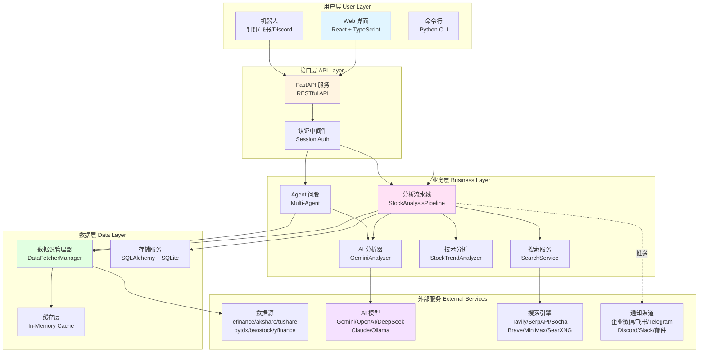
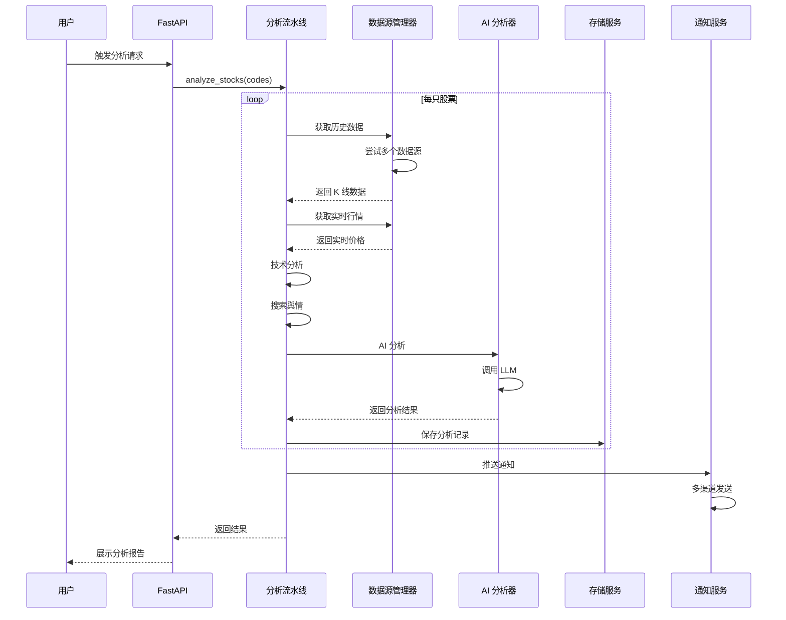
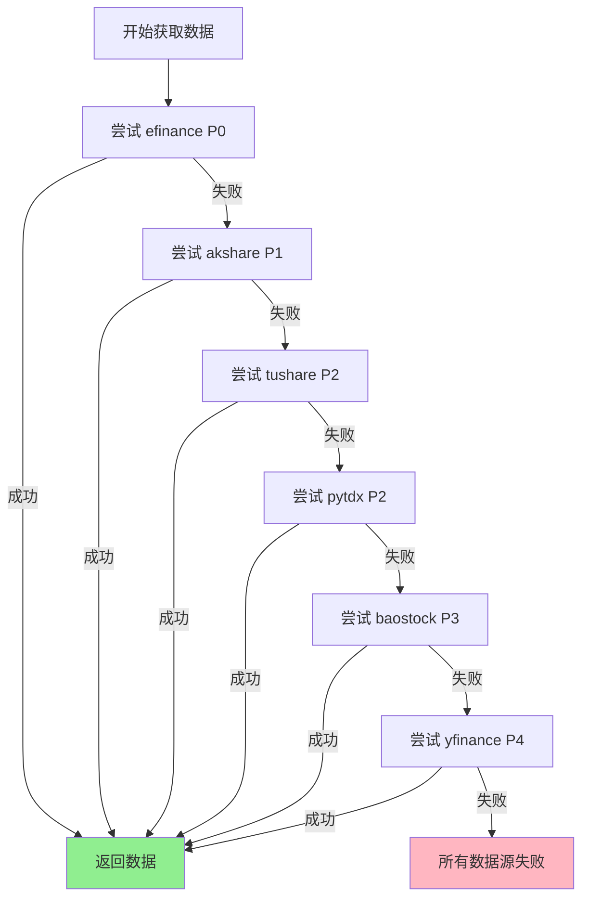
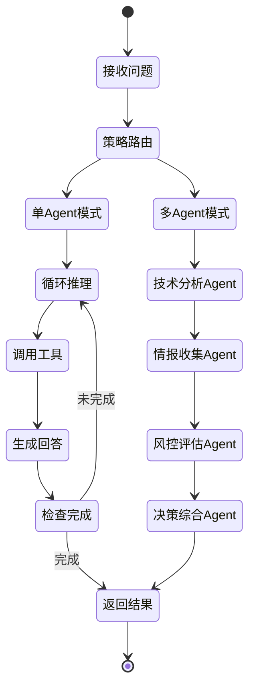
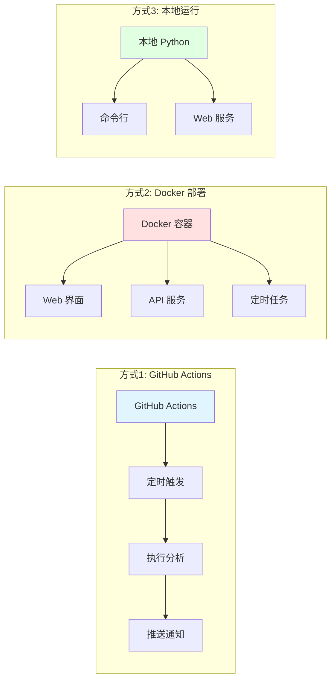

# 股票智能分析系统 - 系统架构文档

> 版本: 1.0
> 更新时间: 2026-03-28
> 作者: System Architecture Team

## 📋 目录

- [1. 系统概览](#1-系统概览)
- [2. 整体架构](#2-整体架构)
- [3. 核心模块](#3-核心模块)
- [4. 数据流](#4-数据流)
- [5. 技术栈](#5-技术栈)
- [6. 部署架构](#6-部署架构)

---

## 1. 系统概览

### 1.1 系统定位

基于 AI 大模型的 A股/港股/美股智能分析系统，提供：
- 多维度股票分析（技术面 + 基本面 + 舆情）
- AI 决策建议（买入点位 + 止损价 + 目标价）
- 多渠道自动推送（企业微信/飞书/Telegram/邮件等）
- Web 工作台（分析/回测/持仓管理）

### 1.2 核心特性

| 特性 | 说明 |
|------|------|
| 多市场支持 | A股、港股、美股及美股指数 |
| 多数据源 | 6个数据源自动切换（efinance/akshare/tushare/pytdx/baostock/yfinance） |
| AI 分析 | 支持 Gemini/OpenAI/DeepSeek/Claude/Ollama 等多种模型 |
| 实时行情 | 盘中实时 MA 计算、筹码分布分析 |
| 策略系统 | 11种内置策略（均线金叉/缠论/波浪理论等） |
| 回测验证 | 自动评估历史分析准确率 |

---

## 2. 整体架构

### 2.1 系统架构图



### 2.2 分层架构

```
┌─────────────────────────────────────────────────────────────┐
│                      用户层 (User Layer)                      │
│  Web UI (React) │ CLI (Python) │ Bot (钉钉/飞书/Discord)      │
└─────────────────────────────────────────────────────────────┘
                              ↓
┌─────────────────────────────────────────────────────────────┐
│                    接口层 (API Layer)                         │
│  FastAPI │ 认证中间件 │ CORS │ 错误处理 │ 静态文件服务        │
└─────────────────────────────────────────────────────────────┘
                              ↓
┌─────────────────────────────────────────────────────────────┐
│                   业务层 (Business Layer)                     │
│  ┌──────────────┐  ┌──────────────┐  ┌──────────────┐      │
│  │ 分析流水线    │  │ AI 分析器     │  │ 技术分析器    │      │
│  │ Pipeline     │  │ Analyzer     │  │ TrendAnalyzer│      │
│  └──────────────┘  └──────────────┘  └──────────────┘      │
│  ┌──────────────┐  ┌──────────────┐  ┌──────────────┐      │
│  │ 搜索服务      │  │ Agent 问股   │  │ 回测服务      │      │
│  │ SearchSvc    │  │ AgentSvc     │  │ BacktestSvc  │      │
│  └──────────────┘  └──────────────┘  └──────────────┘      │
└─────────────────────────────────────────────────────────────┘
                              ↓
┌─────────────────────────────────────────────────────────────┐
│                    数据层 (Data Layer)                        │
│  ┌──────────────┐  ┌──────────────┐  ┌──────────────┐      │
│  │ 数据源管理器  │  │ 存储服务      │  │ 缓存层        │      │
│  │ FetcherMgr   │  │ Storage      │  │ Cache        │      │
│  └──────────────┘  └──────────────┘  └──────────────┘      │
└─────────────────────────────────────────────────────────────┘
                              ↓
┌─────────────────────────────────────────────────────────────┐
│                  外部服务 (External Services)                 │
│  数据源 │ AI 模型 │ 搜索引擎 │ 通知渠道                        │
└─────────────────────────────────────────────────────────────┘
```

---

## 3. 核心模块

### 3.1 分析流水线 (StockAnalysisPipeline)

**职责**：
- 协调整个分析流程
- 管理并发执行（ThreadPoolExecutor）
- 异常处理与降级

**核心流程**：
```python
1. 数据获取 → 2. 技术分析 → 3. 舆情搜索 → 4. AI 分析 → 5. 结果存储 → 6. 推送通知
```

**关键特性**：
- 单股失败不影响整体
- 支持 dry-run 模式
- 可配置并发数（默认 3）

### 3.2 数据源管理器 (DataFetcherManager)

**设计模式**：策略模式 (Strategy Pattern)

**数据源优先级**：
```
Priority 0: efinance (东方财富)
Priority 1: akshare (东方财富爬虫)
Priority 2: tushare (挖地兔 Pro) / pytdx (通达信)
Priority 3: baostock (证券宝)
Priority 4: yfinance (Yahoo Finance)
```

**自动切换机制**：
```python
for fetcher in sorted_fetchers:
    try:
        data = fetcher.fetch(stock_code)
        if data is not None:
            return data
    except Exception:
        continue  # 自动切换到下一个
```

### 3.3 AI 分析器 (GeminiAnalyzer)

**支持的模型**：
- Gemini (Google)
- OpenAI (GPT-4/GPT-3.5)
- DeepSeek
- Claude (Anthropic)
- Ollama (本地模型)
- 通义千问 (Qwen)

**统一接口**：通过 LiteLLM 实现多模型统一调用

**分析输出**：
```python
{
    "conclusion": "一句话核心结论",
    "buy_price": 123.45,
    "stop_loss": 120.00,
    "target_price": 130.00,
    "buy_signal": "买入/持有/观望",
    "checklist": [...],
    "confidence": 0.85
}
```

### 3.4 技术分析器 (StockTrendAnalyzer)

**分析指标**：
- 均线系统：MA5, MA10, MA20, MA60
- 多头排列判断：MA5 > MA10 > MA20
- 乖离率计算：(当前价 - MA5) / MA5 * 100
- 量价关系：量比、换手率
- 筹码分布：获利比例、集中度

**买入信号判断**：
```python
if 多头排列 and 乖离率 < 5% and 量比 > 1.0:
    return "买入"
elif 多头排列:
    return "持有"
else:
    return "观望"
```

### 3.5 搜索服务 (SearchService)

**支持的搜索引擎**：
- Tavily (每月 1000 次免费)
- SerpAPI (每月 100 次免费)
- Bocha (中文搜索优化)
- Brave Search
- MiniMax (Coding Plan Web Search)
- SearXNG (私有部署/公共实例)

**多维度情报搜索**：
1. 最新消息：公司动态、业绩公告
2. 机构分析：券商研报、评级
3. 风险排查：减持、处罚、诉讼
4. 业绩预期：财报预告、业绩指引

### 3.6 Agent 问股系统

**架构模式**：
- Single-Agent：单一 Agent 循环推理
- Multi-Agent：多 Agent 协作（技术→情报→风控→决策）

**内置策略** (11种)：
```
bull_trend          - 多头趋势
ma_golden_cross     - 均线金叉
volume_breakout     - 放量突破
shrink_pullback     - 缩量回踩
bottom_volume       - 底部放量
dragon_head         - 龙头策略
one_yang_three_yin  - 一阳夹三阴
box_oscillation     - 箱体震荡
chan_theory         - 缠论
wave_theory         - 波浪理论
emotion_cycle       - 情绪周期
```

---

## 4. 数据流

### 4.1 股票分析流程



### 4.2 数据源切换流程



### 4.3 Agent 问股流程



---

## 5. 技术栈

### 5.1 后端技术栈

| 类别 | 技术 | 版本 | 用途 |
|------|------|------|------|
| 语言 | Python | 3.10+ | 主要开发语言 |
| Web 框架 | FastAPI | 最新 | RESTful API |
| ORM | SQLAlchemy | 2.0+ | 数据库操作 |
| 数据库 | SQLite | - | 数据存储 |
| 数据处理 | Pandas | 2.0+ | 数据分析 |
| AI 集成 | LiteLLM | 1.80+ | 统一 LLM 调用 |
| 任务调度 | schedule | 1.2+ | 定时任务 |
| 异步 | asyncio | 内置 | 异步 I/O |

### 5.2 前端技术栈

| 类别 | 技术 | 用途 |
|------|------|------|
| 框架 | React 18 | UI 框架 |
| 语言 | TypeScript | 类型安全 |
| 构建工具 | Vite | 快速构建 |
| 状态管理 | React Hooks | 状态管理 |
| UI 组件 | 自定义组件 | 界面展示 |
| 图表 | 自定义图表 | 数据可视化 |

### 5.3 桌面端技术栈

| 类别 | 技术 | 用途 |
|------|------|------|
| 框架 | Electron | 跨平台桌面应用 |
| 前端 | React + Vite | 复用 Web 前端 |
| 打包 | electron-builder | 应用打包 |

### 5.4 数据源

| 数据源 | 优先级 | 市场 | 特点 |
|--------|--------|------|------|
| efinance | P0 | A股/港股 | 东方财富官方，稳定性高 |
| akshare | P1 | A股/港股 | 爬虫数据，覆盖全面 |
| tushare | P2 | A股 | 需要积分，数据质量高 |
| pytdx | P2 | A股 | 通达信协议，实时性好 |
| baostock | P3 | A股 | 免费，历史数据完整 |
| yfinance | P4 | 全球 | Yahoo Finance，美股首选 |

### 5.5 AI 模型支持

| 提供商 | 模型 | 特点 |
|--------|------|------|
| Google | Gemini 2.0 Flash | 免费额度大，速度快 |
| OpenAI | GPT-4/GPT-3.5 | 质量高，成本较高 |
| DeepSeek | deepseek-chat | 性价比高，中文友好 |
| Anthropic | Claude 3.5 | 推理能力强 |
| Ollama | qwen/llama | 本地部署，隐私保护 |
| AIHubMix | 聚合平台 | 一个 Key 多模型 |

---

## 6. 部署架构

### 6.1 部署方式



### 6.2 GitHub Actions 部署

**优势**：
- ✅ 零成本，无需服务器
- ✅ 自动定时执行
- ✅ 5 分钟完成部署

**架构**：
```
GitHub Repository
├── .github/workflows/
│   ├── daily_analysis.yml    # 每日分析
│   ├── market_review.yml     # 大盘复盘
│   └── ci.yml                # 持续集成
├── Secrets (环境变量)
│   ├── GEMINI_API_KEY
│   ├── STOCK_LIST
│   └── FEISHU_WEBHOOK_URL
└── Actions 执行环境
    └── Ubuntu Latest
```

### 6.3 Docker 部署架构

```
┌─────────────────────────────────────────┐
│         Docker Container                │
│                                         │
│  ┌─────────────────────────────────┐   │
│  │   Nginx (可选)                   │   │
│  │   反向代理 + 静态文件             │   │
│  └─────────────────────────────────┘   │
│              ↓                          │
│  ┌─────────────────────────────────┐   │
│  │   Uvicorn (FastAPI)             │   │
│  │   端口: 8000                     │   │
│  └─────────────────────────────────┘   │
│              ↓                          │
│  ┌─────────────────────────────────┐   │
│  │   SQLite Database               │   │
│  │   /data/stock_analysis.db       │   │
│  └─────────────────────────────────┘   │
│                                         │
│  ┌─────────────────────────────────┐   │
│  │   Cron / Schedule               │   │
│  │   定时任务                       │   │
│  └─────────────────────────────────┘   │
└─────────────────────────────────────────┘
         ↓                    ↓
    Volume Mount         Network
    ./data:/data        Port 8000
```

### 6.4 目录结构

```
daily_stock_analysis/
├── api/                    # FastAPI 接口层
│   ├── v1/                # API v1 版本
│   │   ├── endpoints/     # 端点实现
│   │   └── schemas/       # 数据模型
│   └── middlewares/       # 中间件
├── apps/                  # 前端应用
│   ├── dsa-web/          # Web 前端 (React)
│   └── dsa-desktop/      # 桌面端 (Electron)
├── bot/                   # 机器人集成
│   ├── platforms/        # 各平台实现
│   └── commands/         # 命令处理
├── data_provider/        # 数据源层
│   ├── efinance_fetcher.py
│   ├── akshare_fetcher.py
│   └── base.py           # 基类与管理器
├── src/                  # 核心业务层
│   ├── core/            # 核心模块
│   │   ├── pipeline.py  # 分析流水线
│   │   └── market_review.py
│   ├── services/        # 业务服务
│   ├── repositories/    # 数据访问
│   └── agent/          # Agent 系统
├── tests/               # 测试
├── docs/                # 文档
│   └── architecture/    # 架构文档
├── main.py             # 主入口
├── server.py           # Web 服务入口
└── requirements.txt    # 依赖列表
```

---

## 7. 关键设计决策

### 7.1 为什么选择 SQLite？

**优势**：
- ✅ 零配置，无需独立数据库服务
- ✅ 单文件存储，易于备份和迁移
- ✅ 适合中小规模数据（< 100GB）
- ✅ 支持并发读，写入串行化

**限制**：
- ❌ 不适合高并发写入场景
- ❌ 单机部署，无法水平扩展

**迁移建议**：当数据量 > 10GB 或并发用户 > 100 时，考虑迁移到 PostgreSQL

### 7.2 为什么使用多数据源策略？

**原因**：
1. **稳定性**：单一数据源可能失效或限流
2. **覆盖度**：不同数据源覆盖的市场和指标不同
3. **成本**：优先使用免费数据源，付费作为备选

**实现**：
```python
# 策略模式 + 责任链模式
for fetcher in priority_sorted_fetchers:
    try:
        return fetcher.fetch(stock_code)
    except Exception:
        continue  # 自动切换
```

### 7.3 为什么使用 LiteLLM？

**优势**：
- ✅ 统一接口调用多种 LLM
- ✅ 自动重试和负载均衡
- ✅ 支持多 API Key 轮询
- ✅ 内置 token 计数和成本追踪

**示例**：
```python
# 统一调用方式
response = litellm.completion(
    model="gemini/gemini-2.0-flash-exp",
    messages=[{"role": "user", "content": "分析股票"}]
)
```

---

## 8. 性能指标

### 8.1 系统性能

| 指标 | 数值 | 说明 |
|------|------|------|
| 单股分析时间 | 10-30秒 | 包含数据获取、AI 分析 |
| 并发分析数 | 3 | 默认配置，可调整 |
| API 响应时间 | < 100ms | 不含分析任务 |
| 数据库查询 | < 50ms | 单次查询 |
| 前端加载时间 | < 2s | 首次加载 |

### 8.2 资源消耗

| 资源 | 消耗 | 说明 |
|------|------|------|
| 内存 | 200-500MB | 运行时内存 |
| 磁盘 | < 100MB | 代码 + 依赖 |
| 数据库 | 1-10MB | 每月增长 |
| CPU | 低 | 主要等待 I/O |

---

## 9. 安全性设计

### 9.1 认证机制

```
用户登录
    ↓
密码验证 (bcrypt)
    ↓
生成 Session Token
    ↓
存储到 Cookie (HttpOnly + Secure)
    ↓
后续请求携带 Cookie
    ↓
中间件验证 Session
```

### 9.2 安全措施

| 措施 | 实现 |
|------|------|
| 密码加密 | bcrypt 哈希 |
| Session 管理 | 服务端 Session + Cookie |
| CORS 保护 | 配置允许的来源 |
| 限流保护 | 登录失败限流 |
| 输入验证 | Pydantic 模型验证 |
| SQL 注入防护 | SQLAlchemy ORM |

---

## 10. 扩展性设计

### 10.1 水平扩展

**当前限制**：
- SQLite 不支持多实例写入
- Session 存储在内存中

**扩展方案**：
```
1. 数据库迁移：SQLite → PostgreSQL
2. Session 存储：内存 → Redis
3. 负载均衡：Nginx → 多个 FastAPI 实例
4. 消息队列：引入 Celery + RabbitMQ
```

### 10.2 功能扩展

**插件化设计**：
```python
# 数据源插件
class CustomFetcher(BaseFetcher):
    def fetch(self, stock_code):
        # 自定义实现
        pass

# 通知渠道插件
class CustomNotifier(BaseNotifier):
    def send(self, message):
        # 自定义实现
        pass
```

---

## 11. 监控与运维

### 11.1 日志系统

**日志级别**：
```
DEBUG   - 详细调试信息
INFO    - 关键流程节点
WARNING - 非致命错误
ERROR   - 错误信息
```

**日志文件**：
```
logs/
├── stock_analysis_20260328.log       # 常规日志
└── stock_analysis_debug_20260328.log # 调试日志
```

### 11.2 健康检查

**端点**：`GET /health`

**响应**：
```json
{
  "status": "healthy",
  "database": "connected",
  "llm_service": "available",
  "timestamp": "2026-03-28T20:00:00Z"
}
```

---

## 12. 未来规划

### 12.1 短期优化 (1-3个月)

- [ ] 添加 Redis 缓存层
- [ ] 优化数据库索引
- [ ] 增加单元测试覆盖率
- [ ] 完善错误监控

### 12.2 中期规划 (3-6个月)

- [ ] 迁移到 PostgreSQL
- [ ] 实现分布式任务队列
- [ ] 添加实时 WebSocket 推送
- [ ] 支持自定义策略编写

### 12.3 长期愿景 (6-12个月)

- [ ] 机器学习模型集成
- [ ] 量化回测系统
- [ ] 社区策略市场
- [ ] 移动端 App

---

## 13. 参考资料

### 13.1 相关文档

- [完整使用指南](../full-guide.md)
- [常见问题 FAQ](../FAQ.md)
- [更新日志](../CHANGELOG.md)
- [API 文档](http://localhost:8000/docs)

### 13.2 外部资源

- [FastAPI 官方文档](https://fastapi.tiangolo.com/)
- [LiteLLM 文档](https://docs.litellm.ai/)
- [AkShare 文档](https://akshare.akfamily.xyz/)
- [React 官方文档](https://react.dev/)

---

## 附录

### A. 术语表

| 术语 | 说明 |
|------|------|
| MA | Moving Average，移动平均线 |
| 多头排列 | MA5 > MA10 > MA20，上升趋势 |
| 乖离率 | 价格偏离均线的百分比 |
| 量比 | 当日成交量与近期平均量的比值 |
| 换手率 | 成交量占流通股本的比例 |
| 筹码分布 | 不同价位的持仓成本分布 |

### B. 版本历史

| 版本 | 日期 | 说明 |
|------|------|------|
| 1.0 | 2026-03-28 | 初始版本 |

---

**文档维护**：请在重大架构变更时更新本文档

**反馈渠道**：[GitHub Issues](https://github.com/ZhuLinsen/daily_stock_analysis/issues)
